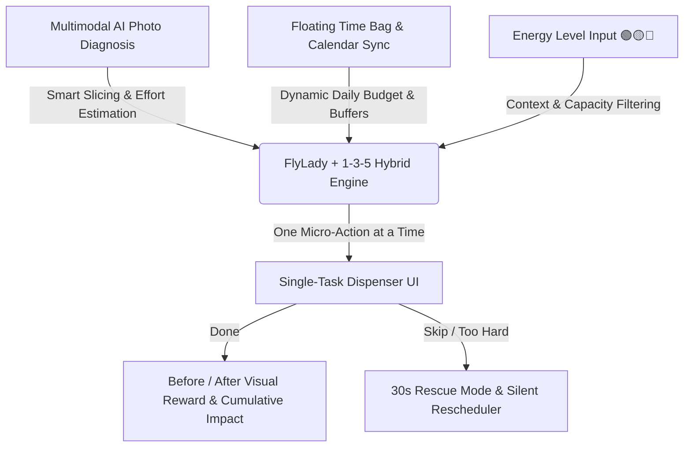
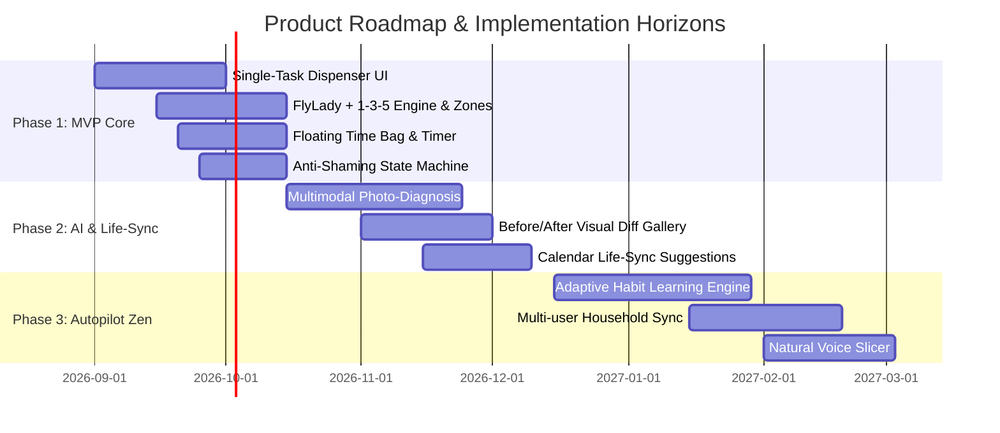

# Product Intent: Anti-Overwhelm Mobile Task Organizer

## 1. Executive Summary & Vision

The **Anti-Overwhelm Mobile Task Organizer** is a friction-free, guilt-proof productivity and household management application designed for individuals overwhelmed by traditional to-do lists, rigid time-blockers, and cluttered task managers. 

Rather than confronting users with overwhelming backlogs, red overdue badges, and broken streak counters, the app acts as an **empathetic autopilot and cognitive shock absorber**. It combines the structured rotational power of **FlyLady zone cleaning** with the simplicity of the **1-3-5 productivity rule**, powered by **Multimodal AI Computer Vision** and a **Single-Task Dispenser UI**. By converting massive chores into bite-sized micro-actions (30 seconds to 10 minutes) distributed seamlessly across days, the application empowers users to maintain momentum effortlessly without choice paralysis, burnout, or shame.

---

## 2. Core Problem & Emotional Job to Be Done (JTBD)

### The Core Problem
Conventional productivity and household apps fail users psychologically:
- **Choice Paralysis & Cognitive Overload:** Endless lists and complex category triage exhaust the user before work even begins.
- **Marathon Burnout:** Users postpone large tasks (e.g., "Clean garage", "Organize closet") until forced into exhausting weekend marathons.
- **The Shame & Guilt Spiral:** Missed dates trigger aggressive alerts, red text, and broken streak metrics, leading to app abandonment.
- **Rigid Scheduling Conflict:** Rigid hourly blocks clash with the messy reality of daily life, unexpected leisure, and variable energy levels.

### The Emotional Job to Be Done (JTBD)
> *"When I feel overwhelmed by home chores and daily tasks, I don't want a manager cracking a whip over a mountain of to-dos. I want an empathetic, invisible autopilot that tells me exactly what single 5-minute action to do right now, absorbs my guilt when life happens, and guarantees steady progress so I can reclaim my free time without stress."*

| Dimension | Traditional Task Managers | Anti-Overwhelm Organizer |
| :--- | :--- | :--- |
| **Interface Paradigm** | Cluttered lists, grids, overdue backlogs | **Single-Task Dispenser** (1 action at a time) |
| **Emotional Tone** | Punitive (red alerts, broken streaks, shaming) | **Anti-Shaming** (warm returns, silent rescheduling, guilt-free) |
| **Effort Model** | High-effort weekend marathons | **Micro-chunked distribution** across days |
| **Time Management** | Rigid time slots (e.g., 18:00–19:00) | **Floating Time Bag** ("I have X minutes now") |
| **Task Creation** | Manual, tedious typing and categorization | **Multimodal AI Photo-Diagnosis** & archetypes |

---

## 3. Product Principles

1. **Zero Cognitive Load (Act Without Thinking):**
   - Eliminate backlog triage. The user never selects from a list; the system serves the single best next action based on time, energy, and priority.
2. **Uncompromising Anti-Shaming & Psychological Safety:**
   - No overdue counters, no negative streak penalties, no red warnings.
   - Spontaneous leisure (e.g., meeting friends for a movie) is respected and celebrated, not penalized.
   - Returning after days or weeks of absence triggers a warm, clean reset without historical guilt backlog.
3. **Respect for Spontaneity & Variable Energy:**
   - Life is dynamic. The app adapts instantly to energy drops (🟢 High / 🟡 Medium / 🔴 Low) and unplanned interruptions.
4. **Invisible Safety Buffers:**
   - Deadlines and multi-day targets incorporate invisible background padding, ensuring goals are hit comfortably even with frequent deferrals.
5. **Anti-Marathon Hard Caps:**
   - Enforce protective session timers (e.g., 10–15 min limit). When time is up, the app gives explicit permission to stop and rest.

---

## 4. Architectural & Functional Pillars

### Pillar 1: Single-Task Dispenser (UI/UX Kernel)
The core interaction model strips away all navigational clutter to eliminate decision fatigue.
- **Single-Card Viewport:** The primary screen displays only **one actionable micro-task** card with estimated duration.
- **Binary Low-Friction Interactions:**
  - `[ Done ]`: Completes task, triggers subtle positive feedback, advances to next micro-task.
  - `[ Give me an easier one / Not now ]`: Skips current task without friction, dynamically presenting an alternative.
- **1-Tap Energy Check-in:** Quick triage button toggling capacity (🟢 Full Power, 🟡 Moderate, 🔴 Low Battery), instantly filtering the task queue.
- **30-Second Rescue Mode:** If a task is skipped or deferred 3 consecutive times, the engine automatically contracts it into an irresistible 30-to-60-second micro-step (e.g., *"Just pick up 3 items off the floor"*), breaking the procrastination barrier.

### Pillar 2: Floating Time Bag & Calendar Life-Sync
Dynamic, flexible time commitments replacing rigid hourly time-blocking.
- **Daily Floating Time Budget:** User commits to a modest daily quota (e.g., 15 minutes/day) instead of fixed appointments.
- **"I Have X Minutes Now" Trigger:** On-demand action button letting users trigger an ad-hoc session whenever a pocket of free time emerges.
- **Pause & Silent Recalculation:** If interrupted mid-session, progress is saved immediately and remaining minutes roll smoothly into the daily floating pool without penalty.
- **Smart Calendar Life-Sync:** Inspects external calendar availability (with strict on-device privacy) to proactively suggest ideal, friction-free task pockets.

### Pillar 3: FlyLady + 1-3-5 Hybrid Engine & Dual-Lifecycle Project Structure
An automated balance of continuous maintenance, rotational deep cleans, and low-frequency/seasonal projects.
- **Dual-Lifecycle Project Hierarchy:**
  - **1. Evergreen / Recurring Projects (High Frequency):**
    - Continuous routines and maintenance (daily morning/evening anchors, weekly FlyLady zones like Kitchen or Bathrooms, monthly upkeep).
  - **2. Epic / Low-Frequency & Seasonal Projects (Ad-Hoc / Periodic):**
    - Infrequent or seasonal endeavors (e.g., *Organize storage room / trastero*, *Wash curtains*, *Seasonal closet switch*, *Paint a room*).
    - Dormant by default; activated on demand or suggested gently by seasonal triggers (e.g., *"Spring is here: activate the Closet Switch project at 8 min/day for 5 days?"*).
- **The "Project Weaver" Engine:**
  - Rather than forcing the user to browse through project folders, the engine automatically weaves tasks from active projects into the daily **1-3-5** budget:
    - **1 Focus Chunk (10–15 min):** Drawn directly from the **Active Epic Project** (e.g., 10 min on the storage room) or the active weekly FlyLady zone.
    - **3 Micro-Maintenance Tasks (2–3 min):** Drawn from **Recurring Maintenance Projects** across common areas.
    - **5 Instant Habits (30 sec):** Foundational daily micro-anchors (e.g., wipe sink, ventilate, drink water).
- **Mindful Decluttering Protocol ("You Cannot Organize Clutter"):**
  - Before starting any large organization project (e.g., storage room, closet), the app actively triggers a **Pre-Clean Purge Step**:
    - Prompts empathetic, guilt-free detachment questions (*"Have you used this in the past 12 months?", "Does this deserve your physical and mental space?"*).
    - **The 3-Destination Flow:** Categorize items into *Keep*, *Donate/Sell*, or *Trash/Recycle*.
    - **"Quarantine Box" for the Indecisive:** Items with emotional hesitation are put in a dated 6-month quarantine box; if untouched, the app gently suggests donation.
    - **Cumulative Declutter Metric:** Tracks items and cubic meters of physical/mental space liberated as a high-satisfaction milestone.
- **Invisible Safety Buffer Engine:**
  - Background balancing algorithm that automatically splits Epic Projects across several days with built-in temporal slack, guaranteeing completion milestones without deadline anxiety.

### Pillar 4: Multimodal AI Photo-Diagnosis & Before/After Validation
Cutting-edge computer vision integration making physical task setup and validation tangible and effortless.
- **Space Photo Scan:** The user snaps a quick picture of a messy space (room, closet, desk, kitchen counter).
- **Vision-Driven Smart Slicer:** Multimodal AI analyzes clutter density, classifies objects, and generates a structured sequence of 3-to-5-minute micro-steps.
- **Visual Effort Estimation:** AI calculates accurate time tags per micro-step based on spatial entropy.
- **Before / After Visual Reward:** Compares the initial clutter photo with the completed post-session state, providing a rewarding visual diff and recording cumulative progress in a private transformation album.

---

## 5. Target Platform & Strategic Context

- **Platform Focus:** **Native / Hybrid Mobile App (iOS & Android)**.
- **Strategic Rationale:**
  - **Camera Integration:** Essential for real-time photo-diagnosis, space scanning, and Before/After verification.
  - **Ambient Household Portability:** Users navigate through rooms while performing micro-chores; mobile is the natural form factor.
  - **Haptics & Micro-Interactions:** Tactile feedback on task completion reinforces dopamine loops.
  - **On-Device Privacy:** Local calendar parsing and local image processing protect personal home privacy.

---

## 6. Downstream Recommendations & Implementation Scope

### Phase 1: Minimum Viable Product (MVP)
- **Kernel UX:** Single-Task Dispenser interface with binary actions (`Done` / `Skip`).
- **Energy Mode Selector:** 🟢 High / 🟡 Medium / 🔴 Low state toggles.
- **Zone Engine:** 5 default FlyLady room templates + 1-3-5 auto-balancing algorithm.
- **Time Bag:** Floating daily duration slider (5–30 min) with active session timer and anti-marathon hard stop.
- **Anti-Shaming Core:** Zero overdue counters, warm return greetings, silent queue rebalancing.
- **30s Rescue Mode:** Triggered after 3 skips on a single task.

### Phase 2: Multimodal AI & Life-Sync
- **AI Space Scanner:** Camera photo ingestion analyzed via vision LLM for automated task slicing.
- **Before / After Proof:** Photo comparison gallery and visual momentum milestones.
- **Calendar Integration:** Read-only local calendar sync to surface intelligent "I have a window" prompts.

### Phase 3: Advanced Autopilot & Shared Spaces
- **Adaptive Predictive Engine:** Machine learning on user velocity to continuously calibrate invisible buffers.
- **Collaborative Household Zones:** Shared zone tasks and distributed floating time bags for couples and families.
- **Voice-First Natural Language Slicer:** Hands-free voice capture and audio task guidance.

---

## 7. Downstream BMad Skill Hand-off

This Intent Document serves as the authoritative architectural and product seed for:
- **`bmad-product-brief` / `bmad-prd`:** Translating JTBD and functional pillars into formal functional requirements, user personas, and acceptance criteria.
- **`bmad-ux`:** Generating low-friction mobile wireframes, micro-interaction states, and zero-shame visual design patterns.
- **`bmad-architecture`:** Defining the local-first mobile client architecture, background scheduling state machine, and multimodal vision API pipeline.
