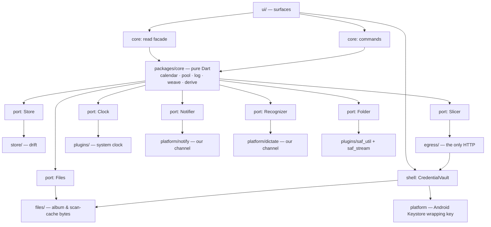
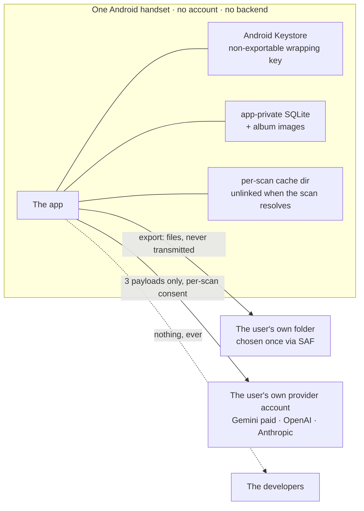
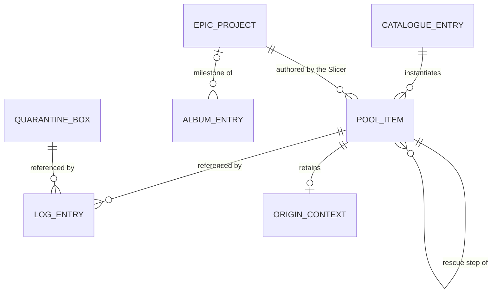

# Architecture Spine — Anti-Overwhelm Mobile Task Organizer

## Design Paradigm

**Functional core / imperative shell**, arranged as **hexagonal ports & adapters**.

The core is **pure Dart with no Flutter, no drift and no plugin imports**. It holds the whole product: the calendar, the pool, the event vocabulary, the weave, every derived signal, the Slicer port, the export shape. It performs no I/O, reads no clock it was not handed, and returns no randomness. The shell is Flutter plus adapters, and it exists only to carry facts in and effects out.

The paradigm is what makes the product's invariants checkable rather than aspirational. `§7`'s *"no field, flag or derived value anywhere may express lateness"* and `§1.1` P2's *"they count only what the user did, never what they didn't"* are statements about a **data substrate**; they hold or fail in the core, which is exercised with `dart test`, on the machine, with no emulator.

Dependency direction, source layout and the port set are in *Structural Seed*; they are one rule stated once.

## Invariants & Rules

### AD-1 — No plan is ever stored; the day is derived

- **Binds:** FR-3, FR-4, FR-5, FR-6, FR-7, FR-9, FR-12, FR-13, FR-14, FR-23, FR-26, §7 no-overdue
- **Prevents:** one unit building a `daily_plan` table while another derives — they cannot coexist, and the stored one makes lateness expressible.
- **Rule:** Persist exactly two kinds of replayable domain fact: the task pool as immutable facts, and the append-only event log (AD-21). Today's composition, the next card, FR-5's decline count, the snowball's comfortable-day run, a capture's deal window, an Epic's buffered target date, **and the settings record** are all returned by pure functions of `(pool, log, day, session)`. There is **no mutable replayable domain record**: `SETTINGS` is a derived cache over `setting_changed` events, rebuilt at start, never a source of truth — which is what makes "what the Time Bag was on day 5" answerable from the export. AD-22's credential envelope and SAF grant are explicitly installation capabilities, not replayable domain state. No table, column or field may name a future assignment. FR-14's Silent Rescheduler is therefore not code: nothing was assigned to a future day, so nothing needs re-planning, and FR-6's Warm Return needs no path of its own.

### AD-2 — Both stores are insert-only, enforced by the database

- **Binds:** AD-1, AD-14, AD-21, AD-25, FR-14, FR-26, §7 no-overdue
- **Prevents:** the no-overdue guarantee decaying into discipline. SQLite puts `UPDATE` and `DELETE` one keyword away, and the entire substrate rests on nobody reaching for them — on either of its two tables.
- **Rule:** Both persisted tables — the log **and the pool** — carry SQL triggers that raise on `UPDATE` and on `DELETE`. Corrections are new entries, never edits. A deletion the user performs is itself an event (AD-13 owns the bytes); pool retirement is a derivation (AD-25), never a deleted row — the cheap wrong implementation must fail at the database, not at review.

### AD-3 — Derivation is deterministic, and "dealt" is written by a command, never by a read

- **Binds:** FR-1, FR-2, FR-3, FR-4, FR-5, FR-12, FR-26, FR-31, SM-1 … SM-4
- **Prevents:** an unreplayable log — which would strip the export of its standing as validation evidence and make FR-31's non-repetition unprovable. And a subtler divergence: `card_dealt` feeds both the least-recently-dealt tie-break and FR-5's *three different days*, and two units writing it at different moments produce different products.
- **Rule:** No `Random`, no wall-clock read, no `dart:io` and no ambient state inside the core; a CI check fails the build if one appears. Ties break by least-recently-dealt, then by stable id. `nextCard()` is pure and **writes nothing**. `card_dealt` is appended by the command that answers the previous card, or by `session_started` for a session's first card — never as a side effect of rendering. A card the user never answered leaves no `card_dealt`, and "declined on a different day" means a `card_skipped` on that day. Every rule that counts deals — the deal window, FR-31's rotation — counts these rows and no others.

### AD-4 — One calendar authority: the day is `[04:00 local, 04:00 local next)`

- **Binds:** FR-4, FR-5, FR-6, FR-7, FR-12, FR-15, FR-21, FR-24, FR-31, SM-1, SM-2
- **Prevents:** the product using "day" for six different things and two units implementing two clocks — concretely, dishes finished at 23:55 and a second Focus Chunk at 00:05 *because it is another day*. The same hazard sits one level up, where a week and a season are load-bearing and were defined nowhere in the inputs.
- **Rule:** One `Calendar` in the core is the **only** thing that converts an instant to a period. Three periods exist and no more:
  - **Day** — `[04:00 local, 04:00 local next)`.
  - **Week** — seven domestic days anchored on **Monday**, so FR-31's zone rotation turns on a boundary the user does not notice; SM-2's Sunday is the week's **last** day, and the week a report asks about is the week that Sunday closes. The weekly self-report **persists until answered**: it is offered at Sunday's first opening and, if unanswered, at each subsequent day's first opening, on any day, until an answer arrives — it does **not** expire at the week boundary. This takes FR-4's reading over SM-2's *"persisting until answered that week"* — an override recorded deliberately, because SM-2 yields **four data points across the whole four-week validation window** and it is the only instrument that measures the product premise, so one unopened Sunday costs a quarter of the build's only subjective evidence. Two consequences follow, and each is stated as a rule because two units would otherwise decide it differently. **A pending report is superseded at the next Sunday, never accumulated:** at most one report is ever pending, the new week's report takes the slot, and the superseded week simply has no data point — which is where SM-2's own *"a week with no answer simply has no data point"* survives. Without it a second report falls due while the first is still pending, two are pending at once, and an answer cannot be attributed to a week at all. **`report_answered` carries the week it answers, not merely its own instant:** under the Sunday-only reading the instant sufficed, because an answer always fell inside the week it reported on; under persistence it can fall outside — answered on a Wednesday for the previous Sunday's question — and without the explicit target week SM-2's week-4-versus-week-1 trend cannot be built at all. That is a payload requirement on the entry kind, carried in AD-21's vocabulary line. One mechanism note, because it is what keeps the daily instrument alive: a pending report **delays** FR-4's energy check-in within an opening rather than displacing it for the day — once the report is answered, or dismissed for that opening, the check-in may take the slot in the same opening.
  - **Season** — three-month meteorological quarters on domestic-day boundaries, for FR-15's *once per season per project*.

  Three consequences, each of which a unit would otherwise decide alone:
  - **A DST transition never creates or destroys a period.**
  - **The zone offset travels with the event.** Every log entry stores its UTC instant *and* the local offset in force when it was written, and a day is computed from the stored offset — never from the device's current zone. Otherwise travel, or a user correcting the clock, silently re-dates history and moves SM-1, FR-5's counter, FR-12's frozen window and FR-31's rotation at once.
  - **Energy is day-scoped**, not session-scoped: the last `energy_set` of the current domestic day, defaulting to 🟢 at each day boundary and never carried across one — the default is derived, never written, so no synthetic `energy_set` row exists at a boundary. A second pocket the same evening does not re-widen a pool the user asked to narrow at 20:00. This rule governs the **live** pool only; retrospective predicates read energy per session (AD-24).

  No other code computes a date boundary — including native code. The Notifier port accepts an **absolute instant only**; FR-24's trigger instant is computed in the core from the chosen hour, interpreted in the **local offset in force at each reschedule** — the invitation follows the user, not the zone the hour was set in — and the Kotlin half performs no date arithmetic of any kind, boot reschedule included.

### AD-5 — Dependency direction is one-way and the core is sealed

- **Binds:** all
- **Prevents:** the core acquiring a Flutter, drift or plugin import, which would end its testability and with it every invariant only checkable there.
- **Rule:** Dependencies point inward only, per the diagram in *Structural Seed*. `packages/core` declares no dependency on `flutter`, `drift` or any plugin, and a CI check fails the build if one appears. Adapters implement ports; the core never names an adapter. **Adapters return inert DTOs and never domain objects** — only the core constructs a pool item, a log event or a period. Without this, an adapter holding a Slicer response would tag origin by *how the data arrived* while the core tags it by *lineage*, and AD-14's inheritance rule would lose silently.

### AD-6 — NL-1 lives in the read API, and no decision carries a verb

- **Binds:** FR-1, FR-12, FR-27, §5.2 NL-1, §1.1 P1, E1
- **Prevents:** two stories each growing a `getPendingTasks()` for a legitimate-looking reason, after which the list is one widget away forever. And a second, subtler leak: a decision named *deal this* is an instruction, so a story can render it and re-open AD-20 while obeying AD-20's letter.
- **Rule:** The read facade exposes no function returning a collection of pending or captured tasks, and `nextCard()` returns at most one card. Derived signals are **named as facts, never as actions** — `captureIsDue`, `rescueIsWarranted`, `bagIsComfortable` — and they are **inputs to `core/weave`, not outputs to the shell** — with one stated crossing: a derived **state** fact (`warmReturnDue`) may reach the shell for a non-work surface (AD-21's second exception); only signals-as-work are confined to the weave. The only thing the shell may render as work is `nextCard()`. E1's list is product content read from the catalogue asset and touches no user data. What may cross to the shell as a number is AD-26's business, not this rule's.

### AD-7 — One egress chokepoint, three payloads, one resolution cap — and the seal covers native code

- **Binds:** FR-5, FR-11, FR-16, FR-25, FR-26, FR-30, FR-32, §7 egress map
- **Prevents:** a fourth destination arriving without anyone deciding to add one — §7's own stated fear, and why FR-32 forbids a speech fallback outright. A Dart-import check alone does not prevent it: a Gradle dependency, a manifest-initialised native SDK, or a socket in one of AD-11's own Kotlin channels is invisible to it, and that is exactly how crash reporting and remote config arrive.
- **Rule:** Exactly one module, `lib/egress/`, may import an HTTP client, and it accepts exactly three payload shapes with no fourth existing as a type: scan image + prompt, project genesis text, rescue re-slice text. It enforces a single image-resolution cap before any upload — one rule serving FR-25's upload minimisation, cost, and how much of the user's home leaves the device. It never queues, never retries and never persists a pending request. **Three checks seal it, not one:** the Dart import check; a check on the resolved Gradle dependency graph against an allowlist; and a check that the merged Android manifest declares no permission, service, receiver or provider outside an enumerated set. The three Kotlin channels of AD-11 are in scope of all three and may open no socket.

### AD-8 — Consent is a single-use token, and the scan's files die with the scan

- **Binds:** FR-16, FR-25, FR-29
- **Prevents:** a cached consent — the blanket *always allow* FR-25 says must not exist. And a photograph of the inside of the home outliving the scan, which the "unlink once a plan exists" rule silently permits on every path where no plan is ever produced.
- **Rule:** The upload function cannot be called without a `ScanConsent`; absence of a token is a compile-time impossibility. The token **binds to the scan's cache subdirectory identity**, is minted after the on-device face gate and before the resolution cap, and is consumable once — so the cap operates inside the binding rather than producing a new subject. Every scan owns one cache subdirectory holding at most two files (the frame and its capped copy), and **both are unlinked when the scan resolves by any means** — a plan, a face refusal, a declined consent, a provider failure, or the user leaving the surface or backgrounding the app (recorded as `scan_abandoned` — the event for every non-completing resolution the user's departure caused) — whichever comes first, with a sweep of that directory at each `app_opened` as the crash backstop. The `consent_granted` event is instrumentation only (FR-26 series b) and carries no capability: the token is never persisted, never exported and never reconstructible from the log.

### AD-9 — The Slicer is a port with two real implementations in the shipped build

- **Binds:** FR-5, FR-11, FR-16, FR-28, FR-29, OQ-1
- **Prevents:** an untested abstraction. FR-28 requires two callers so the interface's swappability is exercised rather than asserted.
- **Rule:** `SlicerPort` has three declared implementations — BYOK, Local, Managed — of which BYOK is usable and Local ships as a canned-slice stub reachable **only in the debug build variant**, its output recognisable as canned. Managed exists as the port's third shape and no proxy, account or billing code. Adding Local or Managed changes no call site outside `lib/egress/`. The provider allowlist is a compile-time constant, never fetched. OQ-1 closed 2026-09-02, so this decision binds: the BYOK implementation's reference provider is **gemini via the provider's direct API**, reference model the `gemini-3.5-flash-lite` class as scored (9/10 through the OpenRouter route on the story 4-1 harness — openai tied at 9/10 and breaks the tie only by cascade order, a tie-break recorded as a dated bar amendment); the exact model id the allowlist carries is fixed when story 4-2 wires the egress. OpenRouter is the fourth allowlist entry — one key reaching every allowlisted model — admitted 2026-09-03 past the same written no-training terms gate (OQ-10), enforced by the app per request: `provider.zdr: true` routes only to zero-data-retention endpoints, and non-retention means no training; the ids story 4-2 fixes must sit in OpenRouter's ZDR endpoint list.

### AD-10 — The provider gate is no-training; the key's tier is the user's

- **Binds:** FR-25, FR-28, OQ-10 `[ADOPTED]`
- **Prevents:** compensating machinery for a guarantee the app is not in a position to make — recurring warnings, age indicators, re-checks, silent removals.
- **Rule:** Allowlist entries carry provider name, written no-training terms, and the verification date with the statement that verification was *on* that date and not since. Retention is not gated. Key entry states **once**, in settings, that a free-tier key may be used for training and that the app cannot tell which tier a key belongs to; nothing repeats it, and the Dispenser never learns a key exists. Stale terms are corrected by shipping a build and by no other mechanism.

### AD-11 — Our own platform channel only where the guarantee *is* an OS API

- **Binds:** FR-24, FR-28, FR-32, §7 background minimalism
- **Prevents:** a story wiring FR-24, FR-28 or FR-32 through a convenient package and voiding the property the FR rests on.
- **Rule:** Three channels, written by us. **notify** — one `NotificationChannel` at `IMPORTANCE_LOW` with `setShowBadge(false)`, created once, never a second channel; importance cannot be changed after creation, which is what makes "incapable of escalating" structural rather than hoped-for (the user may loosen it in system settings; the app can never widen it back). **dictate** — `createOnDeviceSpeechRecognizer()` gated by `isOnDeviceRecognitionAvailable()`, because that pair *forces* on-device and fails rather than falling back, while `EXTRA_PREFER_OFFLINE` is only a hint and FR-32 forbids a fallback outright; and gated further by `checkRecognitionSupport()` / `triggerModelDownload()`, because a *service* being available is not the **Spanish model** being present, and FR-32's "the affordance is simply not present" is a statement about the language, not the service. **credentials** — AndroidKeyStore generates and retains the non-exportable AEAD wrapping key while the encrypted provider envelope lives in Files (AD-22); no general preferences API is exposed. Camera, on-device face detection and folder access remain plugin-served. All three channels are in scope of AD-7's seals, may open no socket, and compute no dates (AD-4).

### AD-12 — The egress map is a closed list; no SDK enters on "it isn't analytics"

- **Binds:** FR-26, §7 egress map, SM-C3
- **Prevents:** crash reporting, remote config, feature flags or a "diagnostics" SDK arriving one at a time, each defensible alone.
- **Rule:** No third-party SDK that opens a network destination may be added, for any reason; AD-7's Gradle and manifest checks are what enforce it rather than good intentions. Crash visibility is a **`crash_recorded` system event** (AD-21) carrying stack and timestamp and no task text, no image paths, no prompt and no URL — so it survives restore, rides the round-trip property, and needs no third store. It is rendered into the export's derived half and transmits nothing, reaching the builder only when a person hands over their export.

### AD-13 — The export has an authoritative half and a derived half; restore reads only the authoritative

- **Binds:** FR-18, FR-26, FR-30, §7 one-format-three-uses
- **Prevents:** a restore from the summary that silently loses data; an export that contradicts itself; and a torn write, which is worse than either because the round-trip test as first specified exports once from a quiescent state and would never see it.
- **Rule:** `AUTHORITATIVE/` holds immutable generation snapshots of the log and pool, content-addressed album-image blobs, and each generation's commit manifest — and nothing else. The commit manifest is protocol metadata, not an editable album model: the **album manifest remains derived**, because an independently editable album manifest lets one unit delete by removing a row while another deletes by appending an event. `derived/` holds that album manifest, the four FR-26 series rendered for reading, and the crash log, and is **never read on import**.
  - **Album bytes.** `album_entry_deleted` **unlinks the app-private source file** in the same operation; the purge unlinks all app-private album files. Exported content-addressed blobs instead obey the retained-generation reachability rule below: deleting the source never invalidates an already committed generation.
  - **One coordinator, one snapshot.** One process-wide foreground coordinator serialises export, import, cleanup and album-byte mutation; none runs in a background isolate or second process. A trigger arriving while an export runs is **dropped, not queued** (AD-7's no-queue rule, applied here) — AD-17's two triggers fire within milliseconds of each other at the end of a session. While holding the coordinator, Store supplies pool and log from the **same SQLite read transaction**, so a byte-perfect generation cannot still be logically torn.
  - **Import across versions.** The import applies AD-23's tolerance — unknown kinds and fields are preserved verbatim, defaulted where a default exists; refusal is reserved for structural corruption (truncation, malformed records) and nothing else. A record is **malformed** iff it fails to parse as JSON or a known kind lacks a field with no default — the two shapes the refusal exists for, and both in the property test's corpus. AD-18's ritual imports an export made by a *different* build; tolerating its rows is the contract, not a courtesy.
  - **Observability.** The adapter writes each outcome to the log as `export_recorded` (AD-21) — destination, outcome, cause — and the settings surface renders the **latest success and the latest failure with its cause**: two derivations over the entry stream, not one; **nothing else** observes it: no toast, no badge, no backup-age line (FR-30). Being log entries, both survive process death and restore.
  - **Generation identity and commit.** Under the coordinator, each export reads the newest fully verified manifest, assigns `generationSequence = previous.sequence + 1` (zero at genesis), mints a UUIDv7 `generationId`, and records the previous generation id. Order is the total tuple `(generationSequence, generationId)`; folder enumeration order and wall time are irrelevant. It writes immutable, create-once pool and log snapshots named by the id and any new album bytes once as content-addressed blobs. Last, it writes that generation's create-once `committed` manifest. The manifest is **not in its own inventory**. Its UTF-8 JSON schema fixes canonical lowercase UUID text, integer sequence, nullable predecessor, and inventory entries whose role is exactly `pool` / `log` / `album_blob`, whose contained relative path admits only lowercase ASCII segments with no empty, `.` or `..` segment, whose byte length is non-negative, and whose SHA-256 is 64 lowercase hex characters over the file's exact bytes; fields and inventory are emitted in lexicographic order. A pre-existing target name is structural corruption, never overwritten. No correctness claim relies on SAF rename atomicity.
  - **Selection, retention and cleanup.** Import considers only manifests that are fully visible (never `FLAG_PARTIAL`), parses them, verifies every inventory byte, and chooses the greatest valid tuple; an incomplete, hidden or corrupt newer generation is ignored without invalidating an older one. At least the greatest valid manifest and its verified predecessor are retained. Because SAF does not prove that a listing is globally complete, automatic cleanup **never deletes a committed manifest, a committed generation snapshot or a content-addressed blob**; it may delete only uncommitted debris whose names this installation recorded during its own failed attempt. Compacting older committed generations is Deferred. It never edits a committed generation. A revoked permission, crash, branch or delayed provider visibility can consume space, never destroy a recoverable generation.
  - **The property test** generates arbitrary state, exports, wipes, imports and asserts every derived read model is identical (the SAF destination and credential-availability capabilities are excluded from read-model identity — AD-22). It cuts the export after every write and covers partial provider visibility, missing bytes, checksum mismatch and corrupt or truncated manifests; every case restores the newest fully verified generation or refuses when none exists, never partially restores (FR-30). It also imports a fixture produced by build N+1 into build N and asserts no derived read model regresses. That test is what earns the format the name *restore*.

### AD-14 — Origin is set at genesis and is immutable

- **Binds:** FR-5, FR-26, FR-27, FR-31, SM-4
- **Prevents:** SM-4 becoming unreadable. A hand-written line re-cut by the cloud Slicer still entered the pool by hand.
- **Rule:** Every pool item carries `shipped` / `manual` / `local` / `cloud`, written once at creation and never updated (AD-2 makes that structural). Rescue steps **inherit** the parent's origin. Origin never reaches the Dispenser. Every log entry referencing an item carries it too.

### AD-15 — The shipped ARB *is* the string table

- **Binds:** FR-29, FR-31, §7 copy-is-the-product-surface, SM-C2
- **Prevents:** two string tables, only one of which the audit reads — which would make SM-C2's "guilt events = 0" a claim about half the product's copy. And a placeholder check that passes on any non-empty sentence, including `tu clave no es válida`, the one string both the PRD and the UX spine name as the shaming risk the seven exist to remove.
- **Rule:** `lib/l10n/app_es.arb` is the single table; `lib/strings/` holds no literals and exists only as generated accessors; a lint fails on any string literal reaching a widget. No interpolation that produces a sentence — one atomic value (a numeral or proper name) substituted into an otherwise fixed ARB sentence is permitted, while a sentence assembled from fragments is not; ICU plural/number placeholders and the consent gate's provider-name placeholder are the controlled cases. **The SM-C2 audit list is every key in the shipped ARB, minus an explicit reviewed exclusion list**, so silence adds a string to the audit rather than omitting one. FR-29's seven no-Slicer strings are pinned **by key** in a build check that requires both a non-placeholder value **and** a reviewer sign-off marker in the ARB metadata — existence and review are separate gates.

### AD-16 — The Evergreen catalogue is a build-time asset, and the floor is proved where it is load-bearing

- **Binds:** FR-5, FR-11, FR-12, FR-29, FR-31, AD-3, AD-14, AD-15, AD-21, AD-23
- **Prevents:** the catalogue drifting into a database the user could reach; the coverage floor becoming an unverified claim; and the subtler failure — a check that counts the *shipped file* while FR-31's floor is stated over the *eligible pool*, which curation moves at runtime. Curation is limited to groups derivable from the tuple: `anclas`, `sostén`, `z1`–`z5`, and `fondo`; A12's `plantas` and `coche` annotations are not independently switchable without a new approved contract.
- **Rule:** The catalogue is a versioned, read-only data file under `assets/evergreen/`, never written, never enumerable to the user below cluster level. Each entry carries **four fields and no more** — a **permanent id** (AD-3's tie-break and AD-23's continuity both need it), a size from the 1-3-5 taxonomy, a cadence, and a zone-or-none — so the weave needs no conversion step. The fourth field is **an override recorded deliberately**, on the same terms as AD-17's domestic day and AD-20's reading of *dealt*: FR-31 says *three fields and no more* and the id is not among them, but AD-3's least-recently-dealt tie-break and AD-23's id-continuity check both need a stable referent, and a `card_dealt` row has none without one. It takes nothing from what FR-31's *no more* actually protects, which is why the override is safe rather than merely convenient: that clause exists to forbid task-level metadata that would make the catalogue browsable or filterable — the property its own following bullets guard, curation at cluster level and no screen enumerating individual entries — and a permanent internal id is not user-visible metadata and adds no such affordance. It is never rendered, never enumerated and never reaches a surface. **The Spanish task name is not in the asset**: it is an ARB entry keyed by the id (AD-15), so catalogue copy is audited on the same terms as everything else and the second locale is a translation. **A `shipped` task's Origin Context is that Spanish name**, and it reaches the core with no schema change: AD-21's named shell loader resolves the entry's ARB key at load time and hands the resolved name to the core alongside the four fields, as inert data. This is what gives FR-5's re-slice text to work from when the declined item is a catalogue entry — without it the decline heuristic fires on an item the Slicer cannot be asked about. Four rules stand unchanged as a result, which is the point of resolving it here: the asset gains nothing (**four fields and no more**), the name stays an ARB entry audited like every other string (AD-15), the core imports no localisation (AD-5) — a core holding one localised line is already true of every Manual Capture, so this is no new property — and rescue steps still inherit the parent's origin (AD-14), so a rescued shipped task's steps carry `shipped` and SM-4's arithmetic does not move. Offline the rescue degrades per FR-29 like any other: nothing is queued and the original stays dealable. Two checks, because one property is not the other: `tool/` counts distinct 10–15 min non-daily entries and fails below 28; and a core test asserts the Focus-Chunk rotation never repeats within 28 deals for the **default** curation state, and that AD-20's fallback is defined when curation drops the eligible pool below the floor. Cluster curation changes take effect at the **next week boundary** for weekly zones — the rotation argument is theirs — and **immediately** for daily and `fondo` clusters, where FR-31's *simply never appear* governs; AD-20's fallback governs a below-floor remainder either way.

### AD-17 — Permissions and background work: three at the point of use, one inexact alarm

- **Binds:** FR-16, FR-24, FR-32, §7 background minimalism, OQ-8 `[ADOPTED]`
- **Prevents:** a first-run permission wall, a second notification category, and an exact-alarm permission requested for a content-free ping.
- **Rule:** Runtime permissions are exactly three — `CAMERA`, `POST_NOTIFICATIONS`, `RECORD_AUDIO` — each requested at the moment its feature is first used, never at app entry or during first run; each refusal leaves the app working, is recorded as a `permission_refused` system event (AD-21) so it survives restore rather than living in a fourth store, and is never asked again — via the derived `permissionMayBeAsked` fact, one of AD-21's stated reader exceptions. `RECEIVE_BOOT_COMPLETED` is declared as the one install-time permission beyond those three, for the reschedule below, and is inside AD-7's manifest allowlist. FR-24 is delivered by an **inexact** alarm, at most one per **domestic day** (AD-4, not a rolling 24 h — a chosen hour of 03:30 would otherwise straddle two days), rescheduled after boot from an instant the core computed. No exact-alarm permission is requested. The invitation is the only background work in the build; FR-30's export runs in the foreground at session end and app backgrounding (AD-13 makes those two triggers safe).

### AD-18 — The update path is the restore path

- **Binds:** FR-30, SM-1, SM-2, AD-23, §8
- **Prevents:** a mid-window fix costing the validation its data, and the import staying an untested promise.
- **Rule:** Every build is signed with the same keystore so install-on-top preserves data and the schema migration runs. The release ritual is: export on all three handsets, install on top, import if a migration fails. No store distribution; the debug variant is never installed on a validation handset.

### AD-19 — There is no session of record; the session is derived, and it belongs to its own day

- **Binds:** FR-8, FR-9, FR-10, FR-12, FR-23, AD-1, AD-4
- **Prevents:** three things. That one unit holds the session in a provider while another rebuilds it from the log, so process death mid-session makes one deal a fresh card and the other resume the pocket — FR-9 mandates the second. That a session declared at 03:40 evaporates at 04:00 and the day's advance resets under a user who never put the phone down, moving AD-4's *marathon with a comma* from midnight to four in the morning. And that FR-10's extension, having no vocabulary, becomes a second `session_started` whose pocket nobody can identify — which makes the snowball either never fire or fire blind.
- **Rule:** A session is the latest `session_started` with no matching `session_ended`, and it **belongs to the domestic day of its own start instant**. A day boundary crossed inside a session neither ends it nor resets the day's advance; the advance — **every `card_*` act of the session, dealt, done or skipped, chunk-class or not, plus occupancy and rotation** — is **one ledger**, charged to the session's own day (AD-20 states the slot rule it implies), and the next day's slot resolves at the first deal after the session closes. The **declared pocket** is `session_started`'s pocket plus the sum of its `session_extended` events. A session is closed only by `session_ended`, which is emitted by exactly three causes and no others: the user stopping, the declared pocket elapsing while the app is foregrounded, and the app being backgrounded. FR-3's early close is the first cause — the warm close presents the stop, and the tap emits `session_ended`. A pocket fully elapsed at any foreground instant closes the session at that instant: the elapse is revealed, not awaited. After process death mid-session the derived session is still open, and the same foreground rule applies at the next open. FR-23's comfortable-day predicate reads the **original** pocket, so an extension the user chose is never scored as a marathon. Nothing holds session state in memory as the source of truth; the shell may cache it for a frame and must never disagree with the log.

### AD-20 — One resolver owns the Focus Chunk slot, and occupancy is not identity

- **Binds:** FR-3, FR-4, FR-5, FR-7, FR-12, FR-19, FR-27, FR-31
- **Prevents:** two large items in one day arriving legitimately from two places — FR-12 gives the slot to the Epic, the zone or `fondo` *and* gives a pending 10–15 min capture precedence, and neither AD-1 nor AD-3 arbitrates. And the mirror failure: a slot resolved once and for all, so a skip either returns the same card (a wall, against FR-3) or silently spends the day's advance on work the user declined.
- **Rule:** `core/weave` is the only code that may emit a deal. Everything else — capture precedence, the `fondo` fallback, purge injection (FR-19), rescue steps and their depth cap of 1 (FR-5), the 🔴 exclusion (FR-4) — returns candidates with precedence, never a deal.
  - **Occupancy** is once per domestic day: at most one Focus Chunk is ever **answered `Hecho`** in a day, and only a `card_done` — or a completed rescue chain — closes the slot. The slot a `card_done` closes is **the day its dealing session belongs to (AD-19), and no other**: a session crossing 04:00 never occupies the crossed-into day's slot, and once its own day's slot is closed it may not be dealt a Focus Chunk at all. FR-7's *dealt* is read here as answered `Hecho` — an override recorded deliberately, for the literal reading punishes a skip with the loss of the day's large work (the mirror failure above). A completed rescue chain closes the slot of, and consumes rotation on, the day **the session that dealt its last `card_done` belongs to (AD-19)**, and no other — regardless of that day's energy: an override of FR-31's *a 🔴 day consumes nothing of the rotation*, recorded deliberately, for a finishing chain is chosen work completing, not a chunk forced through a red day.
  - **Identity** re-resolves on each deal, so a skip yields a different candidate and **consumes no rotation**; FR-31's floor counts answered deals on the same terms.
  - **Epic arbitration** is the resolver's too: when more than one Epic is active, the chunk's Epic is the least-recently-served active Epic — then activation order, then stable id (AD-3's tie-break discipline).
  - A mid-day Time Bag change re-resolves identity and never re-opens a closed slot.
  - When curation drops the eligible pool below FR-31's floor, the fallback is stated here rather than left to fall through: the zone's own entries, then `fondo`, then the least-recently-dealt eligible entry regardless of zone — repetition, accepted and visible in the export, never an empty day.

### AD-21 — The log holds user acts and system events, and no entry may assert an absence

- **Binds:** FR-24, FR-25, FR-26, FR-29, FR-30, AD-1, AD-2, AD-12, AD-17, SM-C3
- **Prevents:** four separate stories each inventing a home for something that is not a user act. FR-26 series (b) and (d) require *consent declined*, *face refused*, *invitation emitted* and *app opened*; a vocabulary of "one per user act" has no room for them, so one story puts them in the log and another puts the last emission in `SharedPreferences` — a third store, outside AD-1's two shapes, absent from both export halves and invisible to AD-13's round-trip. FR-24's "at most one per 24 h under every code path" then fails on the one path nobody tests: a boot reschedule after the alarm already fired. And **SM-C3 loses the only test the PRD gives it.**
- **Rule:** The log holds two kinds of entry, in one table under AD-2's triggers: **user acts** and **system events**. The invariant is not "only what the user did" — that formulation was too narrow. It is this: **no entry may assert an absence or an obligation.** `invitation_emitted` is a fact; `app_opened` is a fact; *overdue* is neither, and still does not fit. System events are named `*_emitted` / `*_refused` / `*_observed` / `*_recorded` / `*_opened` / `*_declined` / `*_failed`, are readable only by `core/export` and the FR-26 series — excluded from every user-facing derivation by construction, with **three stated exceptions**: the core derives `permissionMayBeAsked(permission)` from `permission_refused` (AD-17's never-ask-again), `warmReturnDue` from `app_opened` (FR-6, AD-24), and the validator surface renders `export_recorded` (settings, not a Dispenser surface — AD-26). The events are enumerated exhaustively: `invitation_emitted`, `app_opened`, `consent_declined`, `face_refused`, `slice_failed`, `crash_recorded`, `permission_refused`, `export_recorded` (outcome and cause — the durable home FR-30's observability needs, surviving process death like every other entry). **No other replayable domain store exists**: no preferences, no side files, nothing outside the pool and log. A `tool/` **store seal** enforces that no persistence API is touched outside **Store, Folder and Files**, with one closed native exception: only CredentialVault may call AndroidKeyStore, and only for AD-22's wrapping key. Files owns app-private album bytes, scan cache and encrypted credential envelopes; CredentialVault composes Files with that key and owns no fourth store. The catalogue asset is loaded once by a named shell loader on the seal's allowlist and handed to the core as data — including each entry's resolved Spanish name, which is a `shipped` task's Origin Context and is stated once, in AD-16. Facts go through Store, destination bytes through Folder, private bytes through Files; no adapter-private persistence exists beyond that named Keystore key.

### AD-22 — No secret is ever an entry, a pool fact, or in either half of the export

- **Binds:** FR-25, FR-28, FR-30, §7 egress map
- **Prevents:** the most damaging thing this spine could have permitted. AD-1 made settings changes events, the vocabulary has one kind for them, AD-13 puts the log in `AUTHORITATIVE/`, and FR-30 writes that into a folder §7 explicitly anticipates being Drive or Dropbox — so a story wiring the settings surface exports the user's provider credential, as one line in a file nobody opens. FR-28 forbids it and no AD carried the prohibition.
- **Rule:** Android Keystore holds one non-exportable wrapping key; it cannot hold the provider's arbitrary API-key string. `CredentialVault` owns provider-scoped ciphertext envelopes in app-private Files storage — never preferences — encrypted by that wrapping key. Plaintext enters only the shell's credential-setting handler and passes directly to the vault for encryption; it never crosses the core, log, pool, export, crash event or URL and is never cached. Save is an atomic provider-scoped replacement under the vault lock; delete is idempotent. `credentialAvailable(provider)` means the complete envelope decrypts successfully now and is **display state only, never request authorisation**. Every `ByokSlicer` request instead executes `withCredential(provider, operation)`: the vault decrypts inside that request scope, supplies the plaintext only to the egress operation, releases its references when the operation returns, and reports missing/corrupt/Android-invalidated material as unavailable without sending. `setting_changed` may carry `selectedProvider` but **never `keyExists` or credential availability**. `providerConfigured` is exactly `selectedProvider != null && credentialAvailable(selectedProvider)`: provider choice is replayable state; usable credential availability is a live installation capability and its single authority is the vault. After restore the choice may remain while configuration is false until a credential is saved. The SAF destination is the same class of capability grant: it rides in `setting_changed`, the export redacts it **to null — never drops the field**, and restore reads it as not configured. Round-trip identity excludes both capabilities. Tests cover save/replace/delete, absent/corrupt/Android-invalidated envelopes and request-time invalidation; a CI check rejects plaintext, provider-key shapes and persisted `keyExists: true` in export fixtures.

### AD-23 — The substrate has a theory of its own evolution

- **Binds:** AD-1, AD-2, AD-3, AD-16, AD-18, FR-26, FR-31, SM-1
- **Prevents:** the risk AD-18 creates and nothing else covered. AD-18 requires shipping new builds onto the validation handsets *during* the four weeks that generate the evidence, while AD-2 forbids ever rewriting what is recorded — so one mid-window build that renames an entry kind, adds a required payload field, or reissues catalogue ids silently changes every derived read model on an upgraded phone: the rotation, the coverage floor, FR-5's counter, SM-1's day set. Every failure here is silent, and the round-trip property cannot see any of it, because it exports and imports one schema against itself.
- **Rule:** Three rules, forward-only, because AD-2 leaves no other path.
  - **Unknown kinds are tolerated and ignored**, never coerced and never fatal. A derivation that meets an entry kind it does not know skips it and continues.
  - **Payloads are additive-only.** A field may be added with a default; none is renamed, retyped or removed. A kind is retired by ceasing to write it, never by deleting its rows.
  - **Catalogue ids are permanent once shipped.** An entry may be added; none is renamed, re-sized or removed, because `card_dealt` rows reference them. A `tool/` check diffs the id set against the previous release and fails on any disappearance or size change.

### AD-24 — One predicate for "an eligible day"

- **Binds:** FR-4, FR-5, FR-6, FR-12, FR-27
- **Prevents:** two counters advancing on different day sets. FR-12's capture window and FR-5's decline counter both freeze on a 🔴 day and on an absence — the PRD says explicitly they are the same mechanism — and AD-1 declares both derived without saying what an eligible day *is*. Two defensible definitions give a capture dealt on day 3 in one build and day 6 in the other, invert FIFO order between two captures, and trigger a rescue a week apart. Neither unit can find it alone: each is correct against its own story.
- **Rule:** `core/derive` exposes exactly one `EligibleDay(item, day)` predicate, and every window, counter and freeze in the product is expressed over it; no story defines a second. Its definition, evaluation stated once: **a domestic day on which at least one session started — by its start instant, no earlier than the item's pool-fact creation; a session outliving its day does not make the later day eligible — and at whose start at least one of that day's sessions found the item's size not excluded.** The energy at a session's start is the last `energy_set` **of that session's own domestic day** at or before its start instant, defaulting to 🟢 at the day boundary — yesterday's 🔴 never freezes today's windows, matching AD-4's carry-free boundary — and an `energy_set` belongs to its own instant's domestic day regardless of session attribution (AD-19). One sibling predicate serves FR-6: `warmReturnDue` — 48 h wall-clock since the later of the last `app_opened` and the last user act (AD-21's second stated reader exception). Item-level candidacy is deliberately excluded — it would make the window depend on the composition the window is an input to.

### AD-25 — Pool membership is derived; nothing synthesises a completion

- **Binds:** FR-5, FR-12, FR-17, FR-26, SM-C1
- **Prevents:** FR-5 requiring two items to leave the pool — a parent marked done by its rescue children, and a rescue that dissolves silently — with no rule for how anything leaves. One unit appends a synthetic `card_done` for the parent, so series (a) reads five completions for a four-step rescue and SM-C1 reads tasks-per-day *upward* for a mechanism meant to make a stuck task smaller; and it inserts a tombstone pool fact nothing else knows about, so in the other unit's build the dissolved item keeps coming back.
- **Rule:** An item is in the pool if a pool fact created it and no derivation retires it. Retirement has exactly two derived causes, both computed in `core/derive`: the completion of its rescue children, and FR-5's dissolution pattern. The dissolution pattern retires **the original item and every not-yet-completed step of that rescue chain, atomically in one derivation** — a surviving sibling would be a fragment of a dissolved task re-woven forever, the exact failure FR-5 exists to end. **No tombstone is stored and no synthetic completion is ever appended** — a parent's completion is derived, and every completion count in FR-26 counts user acts only.

### AD-26 — The validator surface is the one place a number may cross

- **Binds:** FR-20, FR-22, FR-23, FR-26, FR-30, FR-32, §7 settings-vs-Dispenser split, SM-C1, SM-C2
- **Prevents:** AD-6's opacity rule being read as absolute, which it cannot be: FR-23's dashboard shows `4 h 25 min` and `≈ 3 cajas liberadas`, and §7 *requires* the raw FR-26 series to be readable somewhere. Left unsplit, a careful unit refuses to render the dashboard and a careless one exposes the decline count, both citing the same sentence.
- **Rule:** Two classes, and the line is what the number is *about*. **Achievement figures** — cumulative minutes, completed tasks, liberated volume, album highlights — may cross to the shell and are rendered only on the FR-23 dashboard, subject to the denominator rule the UX spine states: if a value could be given a denominator, it does not belong there. **Internal signals** — FR-5's declines, the comfortable-day run, the deal window, any skip total — never cross as numbers, under any circumstances (AD-6). The **validator surface** is settings and nowhere else, and it is the only place that renders the raw FR-26 series, FR-30's export state, and FR-32's per-capture dictation boolean. Nothing on the validator surface is reachable from the Dispenser except through the one quiet affordance — which is **unique, lives in the Dispenser chrome** (its mark is the deferred UX question), and is the only route into the validator surface from any surface within three taps of the Dispenser.

## Consistency Conventions

| Concern | Convention |
| --- | --- |
| Naming — log entries | Past-tense verb phrases, `snake_case`. **User acts:** `card_dealt`, `card_done`, `card_skipped`, `session_started`, `session_extended`, `session_ended`, `energy_set`, `capture_created`, `consent_granted`, `slice_requested`, `slice_returned`, `scan_abandoned` (the user leaving the scan surface or backgrounding the app — AD-8's resolution cause, and FR-26 series (b)'s denominator closes over it), `album_entry_added`, `album_entry_deleted`, `box_created`, `item_triaged` (destination plus an optional coarse volume tag from `bolsa` / `caja` / `caja grande` / `mueble` — never a number, FR-22), `suggestion_dismissed`, `report_answered` (carrying the answer **and the week it answers** — AD-4's persistence lets an answer fall outside its own week, and the instant alone cannot attribute it to one), `epic_activated`, `cluster_curation_changed`, `setting_changed`. **System events:** the eight enumerated in AD-21. A new kind is a new kind, never a flag on an old one. |
| Naming — the forbidden vocabulary | No identifier may contain `overdue`, `late`, `missed`, `pending`, `debt`, `streak`, `skippedCount`, `dueDate` or `backlog`. A lint enforces it; the next person to touch the schema will not have read §1.1. `failed` is permitted in exactly two places — `slice_failed` and the crash path — and nowhere near a task. `Due` as a derived-fact suffix (`captureIsDue`, `warmReturnDue`) is outside the ban; a stored due-anything is not. |
| Naming — files & types | `snake_case.dart` files; core types are plain Dart with no annotations. Ports end in `Port`; adapters name their technology: `DriftStore`, `SafFolder`, `ByokSlicer`. |
| Data — ids | UUIDv7 minted in the shell and handed to the core, so the core stays free of ambient state (AD-3). Catalogue ids are permanent (AD-23). Ids are minted **at the commit of the act or fact they name**; every ordering derivation (FIFO, least-recently-dealt, window anchors) reads recorded act instants, **never id bit patterns**; export/import preserves ids verbatim. |
| Data — time | UTC instant **plus the local offset in force** on every entry; the only conversion to a period is `Calendar` (AD-4). No date-only columns. |
| Data — durations | Seconds as `int`. The three capture sizes and the catalogue sizes are the 1-3-5 taxonomy enum, never free minutes (FR-27). |
| Data — files | Each export generation has immutable JSONL snapshots for log and pool plus AD-13's canonical committed inventory; album images are immutable content-addressed blobs shared across every retained generation. The readable album manifest is derived. Album images and encrypted credential envelopes live in app-private Files storage; scan files live in a per-scan cache subdirectory with AD-8's lifecycle. |
| Data — the dictation boolean | A per-capture pool-fact field (FR-32), readable on the validator surface only (AD-26), and outside AD-14's origin arithmetic — dictation is an input method, not a genesis path. |
| State — mutation | Replayable domain state has two shapes only: append a log entry, or insert a pool fact. Everything else in that domain is derivation, settings included (AD-1). SAF access and the provider credential are installation capabilities with the closed mutation paths in AD-22, never a third domain store. |
| State — errors | No error is styled as an error on a user surface. A failed slice becomes one of FR-29's seven states, chosen in the core; the shell renders one calm surface, never seven. |
| State — Dart state management | Riverpod, shell-only. The core is a pure function and holds no state; providers wrap the read facade and the commands and nothing else. |
| Cross-cutting — logging | No logging framework and no log destination. Diagnostics are AD-12's `crash_recorded` events and nothing more. |
| Cross-cutting — i18n | ARB through `flutter_localizations` / `gen_l10n`, Spanish the only shipped locale, every key present, no key resolved from a computed name (AD-15). The catalogue's id-keyed names are not an exception: the loader reads them through a **generated lookup table keyed by catalogue id**, so every key is still statically present and none is assembled at runtime (AD-16). |
| Cross-cutting — text scaling | Never set `maxLines` or `TextOverflow.ellipsis` on user-facing text — and never `FittedBox`, never a `TextScaler` or `textScaleFactor` override, never a fixed-height container around text. The 200% floor is met by growing and scrolling. One lint bans all five, because the first two alone leave the obvious workarounds open. |
| Cross-cutting — design tokens | `DESIGN.md` is the source of truth. Tokens are transcribed once into `lib/ui/tokens.dart` as named constants and referenced nowhere else by literal value. |
| Cross-cutting — accessibility default | Until screen-reader semantics are specified: no custom semantics, no manual announcements, platform traversal order. Stated so each surface-builder does not invent one. |
| Environment — devbox | Every toolchain command runs inside `devbox shell` (CI: `devbox run --`), never from the host. `devbox.json` and `devbox.lock` are committed; a story that adds a toolchain need adds it to `devbox.json` and re-commits the lock in the same pass. The Flutter SDK is the official tarball of the pinned 3.47.x line with version and sha256 recorded in the bootstrap; a patch bump within the line is a two-value edit plus re-lock plus the gate, and 3.48+ is a decision (NFR21). |
| Testing — the core | `dart test`, no emulator. Guards are named wherever one is nameable — a trigger, a `tool/` check, a lint or a test; AD-4's native clause, AD-6's facade shape, AD-8's file lifecycle, AD-9's variant discipline, AD-11's channel scope, AD-26's reachability, AD-10's terms copy and AD-18's signing ritual are core-test- and review-enforced, and say so here. §7's ≤ 2 s to first card and < 500 ms Done→next are asserted over the derivation; the catalogue asset is parsed lazily and a derivation reads only the log slice its periods need. |
| Testing — the shell | Widget tests only where a surface consumes the read facade or a command — the contract under test is AD-6's (no surface can name a pending collection). Visual and behavioural verification is manual on the three validation handsets, per AD-18's ritual. No golden tests. |
| Testing — where the guards live | `tool/` holds build-time checks for core purity (AD-3, AD-5), the egress seal — three checks: Dart imports, Gradle graph, merged manifest (AD-7) — string placeholders and sign-off (AD-15), the catalogue floor (AD-16), catalogue id continuity (AD-23), reviewed catalogue evolution records for coordinated protected-input changes (AD-16, AD-23), and the store seal (AD-21: no persistence API outside Store, Folder or Files, except CredentialVault's allowlisted AndroidKeyStore wrapping-key access). AD-22's export-fixture check rejects secret values, key shapes and persisted credential-availability claims. Two more live as tests: the generational export round-trip and cut-after-every-write corpus plus the build N+1 fixture (AD-13), and the 28-deal rotation (AD-16). Lints carry the forbidden vocabulary, the text-scaling ban, and the no-literal-strings rule. |

## Stack

Verified against the live web on 2026-08-26 by an independent reviewer; where a first draft was wrong, the correction is what appears here.

| Name | Version | Note |
| --- | --- | --- |
| Flutter | 3.47.x (line pin) | The latest stable patch of the 3.47 line — Dart 3.13.x, and the pubspec already says `^3.13.0`. Patch bumps inside the line are routine and wanted (they are fixes); 3.48+ is a decision, not drift. Brings Java 17 and a Flutter-side minimum of Android API 24 |
| Android target SDK | 36 (Android 16) | API 37 (Android 17) shipped 2026-06-16; Play requires 36 from 2026-08-31 (its live policy page) — the Aug-2027 date for 37 is a projection, and moot while AD-18 rules out store distribution. 37's edge-to-edge and resizability changes are a known follow-up |
| Android minSdk | 33 | **Not** because of the on-device recognizer: `createOnDeviceSpeechRecognizer()` and `isOnDeviceRecognitionAvailable()` are API **31**. 33 is set by `POST_NOTIFICATIONS` and by `checkRecognitionSupport()` / `triggerModelDownload()`, which are what FR-32 needs to know the *Spanish model* is present |
| drift | 2.34.3 | + `drift_flutter` 0.3.1. AD-2's triggers must be declared in a `.drift` file — drift supports them nowhere else — and created in the initial migration |
| `path_provider` | 2.1.6 | The Files adapter's app-private roots (story 4.3). Already resolved transitively via `drift_flutter`; promoted to direct only so `lib/files/` names its own dependency — the resolved Gradle graph is unchanged by the promotion |
| `flutter_riverpod` | 3.4.2 | |
| `camera` | 0.12.0+2 | first-party (flutter.dev) |
| `google_mlkit_face_detection` | 0.15.1 | community-maintained, **not** by Google. 32-bit libs exist but only the 64-bit libs are 16 KB-aligned; `abiFilters` must exclude 32-bit ABIs — which is also the 16 KB page-size condition |
| `saf_util` | 3.1.0 | pickers and persisted permissions **only — it provides no read/write** |
| `saf_stream` | 4.0.1 | the actual write path for FR-30. Missing this pair was the first draft's error |
| credential storage | our own Kotlin `credentials` channel | AndroidKeyStore owns a non-exportable AEAD wrapping key; provider-scoped ciphertext envelopes live in app-private Files storage, never preferences. `flutter_secure_storage` is deliberately not used because it does not expose the wrapping-key + Files-envelope contract AD-22 requires |
| `uuid` | 4.6.0 | RFC 9562 v7. Intra-millisecond monotonicity is **opt-in** (`UuidV7Monotonic`), not the default — and conventions forbid ordering by id bits anyway; AD-3's tie-break is stable-id order, not mint order |
| `image` | 4.9.2 | pure-Dart JPEG/PNG codec, pinned (story 4-2). AD-7's egress resolution cap (1536 px, JPEG q85) runs over it inside `compute()`; no Android footprint, so both native egress seals stay unaffected |
| `flutter_localizations` / `gen_l10n` | ships with Flutter | |
| `material` / `cupertino` | **not a dependency** | The first draft invented these. Material and Cupertino left the core in **3.47**, as opt-in `material_ui` 1.1.0 / `cupertino_ui`; the SDK still ships the libraries and `package:flutter/material.dart` is only *scheduled* for deprecation in the November 2026 stable. Nothing to add to the pubspec today |
| `flutter_local_notifications` | deliberately unused | 22.3.0 and actively maintained; AD-11's carve-out is about where the guarantee lives, not about the package being unfit |
| notify / dictate channels | our own Kotlin | Kotlin 2.4.0 (released 2026-06-03) comes from the Flutter Android template; not ours to choose |
| dev environment | devbox 0.18 | `devbox.json` + committed `devbox.lock` at the root own the toolchain (Story 1.1, NFR21). Build JVM = the newest LTS the pinned stack's Gradle/AGP run on (JDK 21; 25 once the template's Gradle is 9.1+) — never the 17 *minimum*, never a non-LTS. The Java/Kotlin bytecode level is the Flutter template's own setting (17 today) — not ours to choose, inherited with the template. Flutter comes from the official stable tarball of the pinned 3.47.x line, sha256-pinned by the bootstrap — never the nixpkgs `flutter` package, which lags the line's patches (3.47.0 while stable is 3.47.2, 2026-08-27) and is not the official bits |
| Gemma 4 E2B (Local path — **killed 2026-09-02**) | n/a — died before the size mattered | Story 4-1's harness: **3/10** under the 8-of-10 bar, killed outright on desktop per the one-direction rule. All 10 responses markdown-fenced (Lemonade accepts `response_format` but silently ignores it; the single-fence strip is a dated bar amendment, recorded per photo). The Android size was never read off the model card — the candidate died first |
| Gemma 4 E4B (Local path — **killed 2026-09-02**) | **3.66 GB** on disk | Story 4-1's harness: **2/10** — two schema-invalid responses (steps not objects) on top of the judged-limb failures; killed outright on desktop. The 3654 MB Android model size and ~3283 MB peak memory stand as the model-card record of a path this build no longer ships beyond the debug stub (AD-9) |

## Structural Seed







`POOL_ITEM` and `LOG_ENTRY` are the only stored entities. `LOG_ENTRY` is insert-only and holds both user acts and system events (AD-2, AD-21). `CATALOGUE_ENTRY` is a build-time asset, not a database table (AD-16). `ALBUM_ENTRY` is a derived read model over stored image bytes and log acts — there is no album table (AD-13). `QUARANTINE_BOX` is reconstructed from `box_created` and `item_triaged` acts; its follow-up is derived from `box_created`'s instant, never a stored date (AD-1). `SETTINGS`, `SESSION` and pool membership are all **derived** and appear as no entity (AD-1, AD-19, AD-25). An `ALBUM_ENTRY`'s Epic link is optional on both sides, because FR-17 fires a reward on a session milestone over a scanned space that never became an Epic. There is no `DAILY_PLAN`, and no entity carries a due date, a deferral count or a completion ratio.

```text
organizer/
  packages/core/            # pure Dart — no flutter, no drift, no plugins
    lib/day/                # Calendar: the only instant→period conversion (AD-4)
    lib/pool/               # facts: catalogue instance, capture, epic step
    lib/log/                # the entry vocabulary: user acts + system events
    lib/weave/              # composition; the only emitter of a deal (AD-20)
    lib/derive/             # every signal, named as a fact (AD-6, AD-24, AD-25)
    lib/ports/              # Store · Slicer · Clock · Notifier · Recognizer · Folder · Files
    lib/export/             # the authoritative/derived split, as data (AD-13)
  lib/                      # the Flutter shell
    store/                  # drift schema, .drift triggers, migrations
    files/                  # the Files adapter: app-private bytes (album, per-scan cache)
    egress/                 # the ONLY module importing an HTTP client (AD-7)
    platform/notify/        # our channel: one IMPORTANCE_LOW channel
    platform/dictate/       # our channel: on-device recognizer + model gate
    plugins/                # camera · mlkit face · saf_util/saf_stream
    ui/                     # surfaces + tokens.dart
    l10n/app_es.arb         # THE string table (AD-15)
    strings/                # generated accessors only — no literals
  assets/evergreen/         # the catalogue: id, size, cadence, zone (AD-16)
  android/app/src/main/kotlin/   # native halves of notify, dictate, credentials
  tool/                     # the six build-time checks
  test/                     # dart test over core
```

## Capability → Architecture Map

Where each PRD feature group lives. What governs it is the `Binds:` line of each AD.

| Capability | Lives in |
| --- | --- |
| 4.1 Dispenser (FR-1–6) | `core/weave`, `core/derive`, `ui/dispenser` |
| 4.2 Time Bag & Session (FR-7–10) | `core/weave`, `core/log` |
| 4.3 Project Weaver (FR-11–15) | `core/weave`, `core/pool` |
| 4.4 Photo-Diagnosis & rewards (FR-16–18) | `egress`, `plugins/camera`, `plugins/mlkit`, `ui/reward` |
| 4.5 Decluttering Protocol (FR-19–22) | `core/pool`, `core/log`, `ui/destinations` |
| 4.6 Progress (FR-23) | `core/derive`, `ui/dashboard` |
| 4.7 Ambient Invitation (FR-24) | `core/day`, `platform/notify` |
| 4.8 Data handling & export (FR-25, 26, 30) | `egress`, `core/export`, `plugins/saf_*` |
| 4.9 Manual Capture & voice (FR-27, 32) | `core/pool`, `platform/dictate`, `ui/capture` |
| 4.10 AI Access Path (FR-28, 29) | `core/ports/slicer`, `egress` |
| 4.11 Evergreen Library (FR-31) | `assets/evergreen`, `core/pool`, `l10n` |

## Deferred

- **OQ-1's deployment topology.** Closed 2026-09-02, by evidence: **cloud BYOK with gemini, accessed through the provider's direct API** — the Local path is *killed*, not deferred. Both Gemma candidates died on the development machine through the story 4-1 harness (E2B 3/10, E4B 2/10, under the pre-confirmed 8-of-10 bar; E2B fenced every response and Lemonade ignores `response_format`), and the one-direction rule makes a desktop failure fatal because the Android artifact is more aggressively quantized. `flutter_gemma` 1.6.5 and E4B's size/peak figures stand as recorded facts about a path this build ships only as the debug stub (AD-9). The storage, peak-memory, latency and thermal handset questions die with it — there is no local path left to measure. OpenRouter is admitted as the fourth access route (2026-09-03): one key reaching every allowlisted model, past the written no-training gate by the app's own per-request ZDR enforcement (OQ-10). Full evidence: `eval/results/report.md` (story 4-1).
- **Log growth.** Milliseconds over a four-week window with one user. Revisit if a cold start exceeds 1 s; the answer is then an indexed projection rebuilt from the log — never a stored plan, so AD-1 survives it.
- **Multi-user.** The pool and the log carry no owner column. A schema change, accepted knowingly; §5.1 defers households to v3.
- **iOS.** The product lives in a pure Dart package, so a second surface is a shell rather than a rewrite; AD-11's three channels are what would need counterparts. Revisit only if the PRD un-defers it — nothing here is designed toward it.
- **Committed-export compaction.** SAF cannot prove a directory listing is globally complete, so AD-13 automatically removes only named debris from this installation's failed uncommitted attempts and retains every committed generation. Revisit only after measured export growth warrants an explicit, user-visible compaction operation with its own recovery contract.
- **Screen-reader semantics.** `EXPERIENCE.md` OQ-13 records that TalkBack labels, roles and traversal order are discussed nowhere. It has a structural half, so it is named here rather than left with the copy questions, and the conventions carry an interim default. Revisit before the first surface ships to a handset other than the builder's.
- **API 37.** Target 36 is compliant into 2027 (Play's posted floor; the Aug-2027 date for 37 is a projection). Revisit when edge-to-edge and resizability changes are read against the 200% floor and the one-card surface.
- **The three fragile dependencies.** `google_mlkit_face_detection` is community-maintained; `saf_util`/`saf_stream` carry FR-30 between them; `flutter_local_notifications` is deliberately unused. Each is a candidate for promotion to a platform channel under AD-11's rule if the guarantee turns out to rest on the API after all.
- **Design-token generation.** Transcribed by hand once. A generator earns its keep only if the palette moves again; `DESIGN.md`'s OQ-4 (the unfinished dark palette) is the likely trigger.
- **The second locale.** ARB makes adding one a translation rather than a refactor, and AD-16 puts catalogue copy in the same table.
- **UX questions that block surfaces, not structure.** The seven no-Slicer strings (AD-15 gates them at build time), the Warm Return and checkpoint copy, the single quiet affordance's mark, the microphone glyph, Settings IA, the ambient container. None changes an AD.
